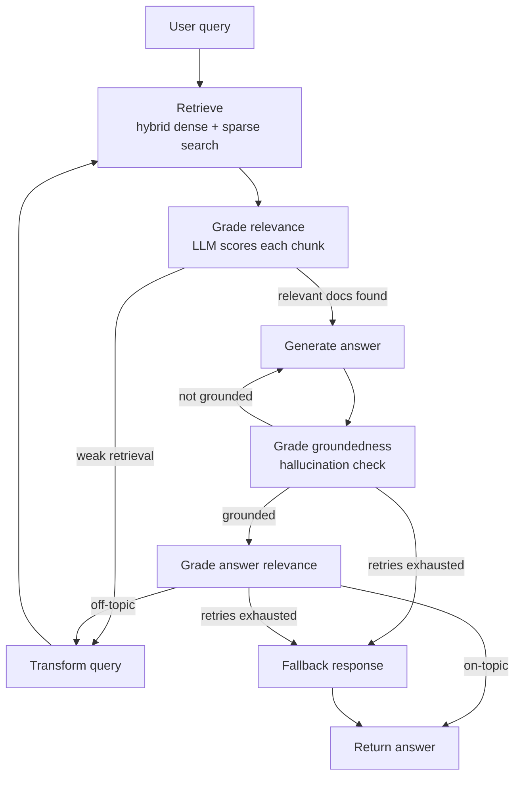

# Autonomous RAG Agent with Hallucination Guardrails

A self-correcting Retrieval-Augmented Generation (RAG) pipeline that grades its own retrievals, re-queries when they're weak, and validates its own answers for groundedness and relevance before ever responding — instead of returning a first-pass answer the way naive RAG does.


## Table of contents

- [Why this exists](#why-this-exists)
- [Architecture](#architecture)
- [Tech stack](#tech-stack)
- [Dataset](#dataset)
- [Setup](#setup)
- [Usage](#usage)
- [Evaluation](#evaluation)
- [Known limitations](#known-limitations)
- [Project structure](#project-structure)
- [Roadmap](#roadmap)
- [Acknowledgments](#acknowledgments)

## Why this exists

Traditional RAG retrieves top-k chunks once, hands them to an LLM, and returns whatever comes back — even if the retrieved chunks were irrelevant or the generated answer isn't actually supported by them. This project treats retrieval and generation as steps that can fail, and builds explicit checks around each one:

- **Retrieval can fail** → a relevance grader filters out irrelevant chunks, and a weak retrieval triggers automatic query rewriting and re-retrieval instead of generating from bad context.
- **Generation can fail** → a groundedness check verifies the answer's claims are actually supported by the retrieved context before it's shown to the user, and regenerates if not.
- **The answer can be ungrounded but still off-topic** → a separate relevance check confirms the (grounded) answer actually addresses the original question.

If retries are exhausted at any stage, the system returns an honest "I don't have enough information" instead of forcing a confident-sounding guess.

## Architecture



Each retry path is capped (default: 2 attempts) so a persistently bad query or model output can't loop forever — it falls through to an honest fallback instead.

## Tech stack

| Component | Choice | Why |
|---|---|---|
| Orchestration | [LangChain](https://python.langchain.com/) + [LangGraph](https://langchain-ai.github.io/langgraph/) | The grade → maybe re-query → generate → validate flow is a graph with conditional branches and cycles, which is what LangGraph is built for |
| Vector store | [Qdrant](https://qdrant.tech/) (embedded mode) | Runs in-process with no server; natively supports dense + sparse vectors in one collection for hybrid retrieval |
| Embeddings | `BAAI/bge-small-en-v1.5` (dense) + BM25 (sparse), via [FastEmbed](https://github.com/qdrant/fastembed) | Small and fast enough to run on a free-tier GPU or even CPU |
| LLM | [Ollama](https://ollama.com/), local (e.g. `llama3.2:3b`) | No API costs, no external dependency, runs fully offline |
| Serving | [FastAPI](https://fastapi.tiangolo.com/) | Lightweight REST endpoint over the compiled LangGraph pipeline |
| Evaluation | [RAGAS](https://docs.ragas.io/) (faithfulness, answer relevancy) | Quantifies the hallucination-rate improvement against a naive-RAG baseline, rather than relying on spot checks |

## Dataset

Built and evaluated on [SQuAD 2.0](https://rajpurkar.github.io/SQuAD-explorer/), which serves double duty here:

- Its Wikipedia passages form the retrieval knowledge base.
- Its question/answer pairs — including questions that are **deliberately unanswerable** from the given passage — form the evaluation set. That's the key property for this project: it directly tests whether the guardrails correctly say "I don't know" instead of hallucinating an answer when the context doesn't support one.

Swap in your own corpus by replacing the ingestion cell — see [Roadmap](#roadmap).

## Setup

This project is built and run in **Google Colab** (free T4 GPU tier), so no local GPU is required.

1. Open the notebook in Colab.
2. `Runtime → Change runtime type → T4 GPU`.
3. Run the setup cell — it installs dependencies and installs + starts Ollama as a background process:

   ```bash
   pip install langchain langgraph langchain-community langchain-ollama \
       qdrant-client fastembed sentence-transformers langchain-huggingface \
       fastapi uvicorn pyngrok nest-asyncio ragas==0.3.9 datasets

   curl -fsSL https://ollama.com/install.sh | sh
   ```

   > `ragas` is pinned to `0.3.9` — later versions have a broken import (`langchain_community.chat_models.vertexai`) that isn't fixed upstream as of this writing.

4. Pull a small local model that fits comfortably on a free-tier GPU:

   ```bash
   ollama pull llama3.2:3b
   ```

5. Run the remaining cells in order — dataset loading, chunking, Qdrant indexing, graph construction, and (optionally) the FastAPI + ngrok serving cell.

## Usage

**Interactively, from the notebook:**

```python
result = app.invoke({
    "question": "What continent is Normandy located on?",
    "documents": [], "generation": "",
    "transform_retries": 0, "hallucination_retries": 0,
    "grounded": None, "answer_relevant": None,
})
print(result["generation"])
```

**As an API**, once the FastAPI cell is running (requires a free [ngrok](https://dashboard.ngrok.com/get-started/your-authtoken) authtoken):

```bash
curl -X POST "<ngrok-url>/ask?q=What+continent+is+Normandy+on"
```

## Evaluation

The eval notebook cell runs a naive RAG baseline (retrieve → generate, no grading) side by side with the full guarded pipeline, scored with RAGAS's `faithfulness` and `answer_relevancy` metrics on a held-out sample of SQuAD 2.0 questions.

| Pipeline | Faithfulness | Answer relevancy |
|---|---|---|
| Naive RAG (baseline) | _fill in from your run_ | _fill in from your run_ |
| Self-correcting (this project) | _fill in from your run_ | _fill in from your run_ |

> These numbers depend on your chosen model, sample size, and corpus — run `Phase 7` in the notebook and drop your actual results in here rather than a placeholder. A real, reproducible number is more credible than a round one.

## Known limitations

- **Small local models grade inconsistently.** A 3B model acting as its own relevance/hallucination judge is noticeably less reliable than GPT-4-class judges — expect some false positives/negatives in the grading steps.
- **RAGAS + local Ollama is slow.** Each graded question costs several sequential LLM calls; evaluating large samples can take a while and may need a generous `RunConfig(timeout=...)`.
- **Colab sessions are ephemeral.** The embedded Qdrant index and pulled Ollama model don't persist across a fresh runtime — either accept re-running setup each session, or persist `qdrant_data/` and model weights to Google Drive.
- **Retry caps trade recall for reliability.** Capping re-queries/regenerations at 2 avoids infinite loops but means a genuinely hard question may hit the fallback response rather than eventually succeeding.

## Project structure

```
.
├── self_correcting_rag_colab.ipynb   # end-to-end notebook: setup → ingest → index → graph → serve → eval
└── README.md
```

## Roadmap

- [ ] Swap SQuAD for a domain-specific corpus (docs, PDFs, etc.)
- [ ] Add source citations to generated answers
- [ ] Add a reranking step after hybrid retrieval
- [ ] Persist the Qdrant index and Ollama model across sessions (Drive-backed)
- [ ] Move off Colab to a persistent deployment (small VM or container) behind FastAPI
- [ ] Expand the RAGAS eval set beyond a 25–50 question sample

## Acknowledgments

- [SQuAD 2.0](https://rajpurkar.github.io/SQuAD-explorer/) — Rajpurkar et al.
- The LangGraph [Corrective RAG / Self-RAG](https://langchain-ai.github.io/langgraph/) reference patterns this pipeline's graph structure is based on
- [RAGAS](https://docs.ragas.io/) for the evaluation framework
